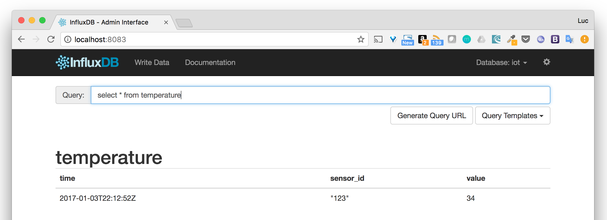

# Objectives

We will not touch our application code in this step and focus instead on the underlying database that we will use to persist the data.
In the next step, we will see how to integrate it on our application.

To persist the data, we will use [InfluxDB](https://github.com/influxdata/influxdb), a great open source Time Serie Database.

If you want to know more about InfluxDB, I hightly recommend you have a look at the [documentation](https://docs.influxdata.com/influxdb/v1.2/concepts/key_concepts/).

# Instructions

* Go to the Docker Hub page of the official [Influxdb image](https://hub.docker.com/_/influxdb/)

A lot of information are provided concerning the usage of this image, its configuration, the port that needs to be exported, ...

* Use the following command to generate the default configuration file

````
docker container run --rm influxdb influxd config > influxdb.conf
````

* Modify the admin part of the configuration file so that the administration interface is enabled

````
[admin]
  enabled = true
  bind-address = ":8083"
  https-enabled = false
  https-certificate = "/etc/ssl/influxdb.pem"
````

* Create a volume named *influxdata*

For this, we use the Docker's volume CLI with the default driver

````
docker volume create influxdata
````

* Run a container using the named volume and the modified configuration file

To run a InfluxDB container, several option need to be provided to the *docker container run* command to

* specify the port to publish on the host (8086 is the API port, 8083 is the port used to save the administration web interface)
* bind mount the configuration file from the local folder into the container's /etc/influxdb folder
* specify the volume to use to persist the data
* specify a name that will make it handy to get container's information (more on that soon)

````
docker container run -p 8083:8083 -p 8086:8086 \
      -v $PWD/influxdb.conf:/etc/influxdb/influxdb.conf:ro \
      -v influxdata:/var/lib/influxdb \
      --name influx
      influxdb -config /etc/influxdb/influxdb.conf
````

For the next step, we will need to get the IP address of the Influx container, let's get it with the following command

````
$ docker container inspect -f '{{ .NetworkSettings.IPAddress }}' influx
172.17.0.2
````

Note: you might not get the same one in your machine

# Setting up the database

Influxdb administration interface should be available on (http://localhost:8083)


We will start be creating a database named *iot* using the following HTTP request targeting Influxdb's API

````
curl -i -XPOST http://localhost:8086/query --data-urlencode "q=CREATE DATABASE iot"
````

The database creation can easily be done using the administration web interface but it's interesting to see that under the hoods everything happends through HTTP requests.


Now that the database is ready, let's create a test entry using InfluxDB's HTTP API.

````
curl -i -XPOST 'http://localhost:8086/write?db=iot' --data-binary 'data,type=temp,sensor_id=123 value=34 1483481572000000000'
````

This HTTP Post request creates a *point*, in the data *measurement*. This point has the fields *sensor_id* and *value* with the respective values of 123 and 34. *type* is a *tag* with the value *temp*.
*measurement*, *point*, *field*, *tag*, ... are all InfluxDB terminology that is cover in the [InfluxDB key concepts](https://docs.influxdata.com/influxdb/v1.2/concepts/key_concepts/).

Basically, in a first approximation, we can see a *measurment* as a regular SQL table, a *point* as a record of this table. A *point* is a list of *fields* and their value and a list of *tags* and their value, *tags* and *fields* are different in the sense that *tags* are indexed when *fields* are not.

* Verify using the administration interface

Issuing the following SQL command within the administration interface enables to retrive the *point* created above.


