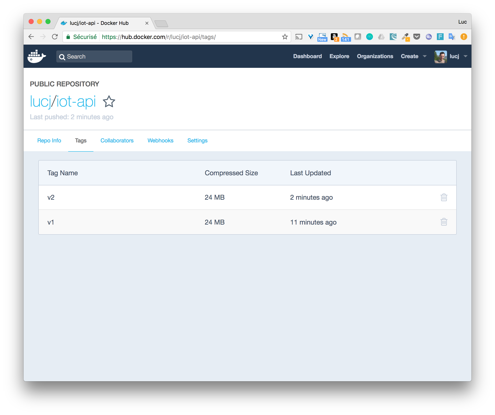

# Objectives

Modify the application so it uses InfluxDB to persist the data received

# Instructions

* Use an InfluxDB driver for the langage you selected
* Use this driver to persist the json data received
* Get the *type* tag, the *sensor_id* and *value* fields from the request's body
* Specify the InfluxDB host through the INFLUXDB_HOST environment variable

# Implementation

[Node.js](./nodejs)

# Building the new image

When the changes above are done in the code, we create a new version of the image. Instead of tagging the image to the format expected by the registry in a second step, we can name use the target image name right away. You will need to use your Docker Hub username though.

````
docker image build -t lucj/iot-api:v2 .
````

# Run a container based on the new image

As the application now relies on the underlying InfluxDB database, we will provide the IP of the container running InfluxDB to the API container (172.17.0.2 in our example, but yours might be different).

````
docker container run -e "INFLUXDB_HOST=172.17.0.2" -p 1337:1337 lucj/iot-api:v2
````

Notes
* this is a temporary setup to show an example on how a container can use the service of another one. We will enhance this in the next steps when dealing with Docker Compose.
* containers can see each other using their IP addresses as they are on the same *Docker0* default bridge network.

# Push the new version of image to the registry

As the image is already tagged into the correct format, we just need to push it to the Docker Hub.

````
$ docker image push lucj/iot-api:v2
The push refers to a repository [docker.io/lucj/iot-api]
f3e959ead19c: Pushed
e8800c4ab975: Pushed
03383574868d: Pushed
b2f6f834570f: Pushed
8e254b51dfd6: Layer already exists
60ab55d3379d: Layer already exists
v2: digest: sha256:7a9616b6ae3b1b57f48a96c5b3c9dfcf27bd3069bbedbdde449d09e1cd759499 size: 1580
````

Both tags, *v1* and *v2* are available on the Docker Hub.



-----
[< Previous](../step4) - [Next >](../step6)
