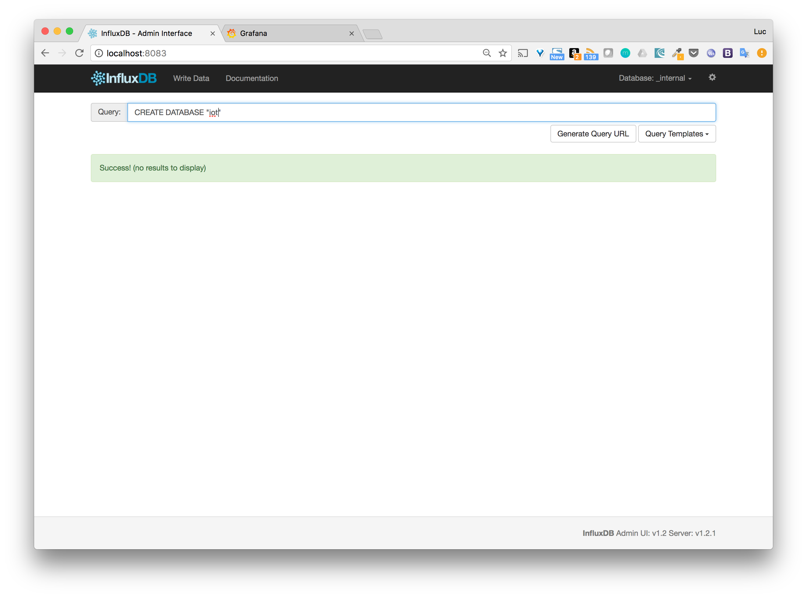
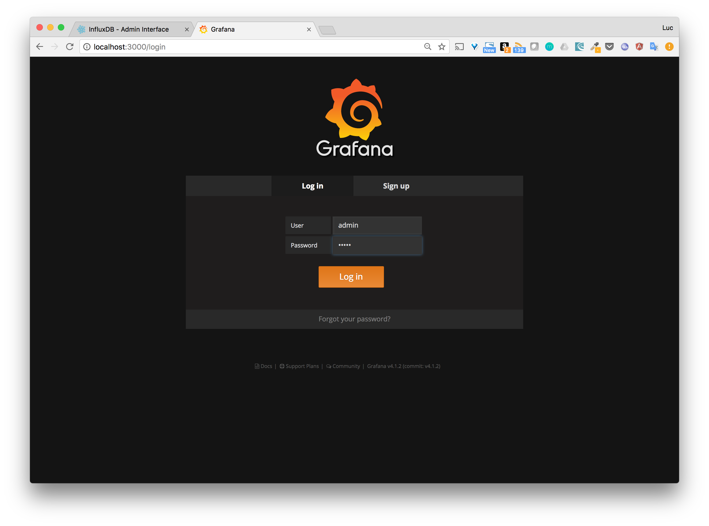
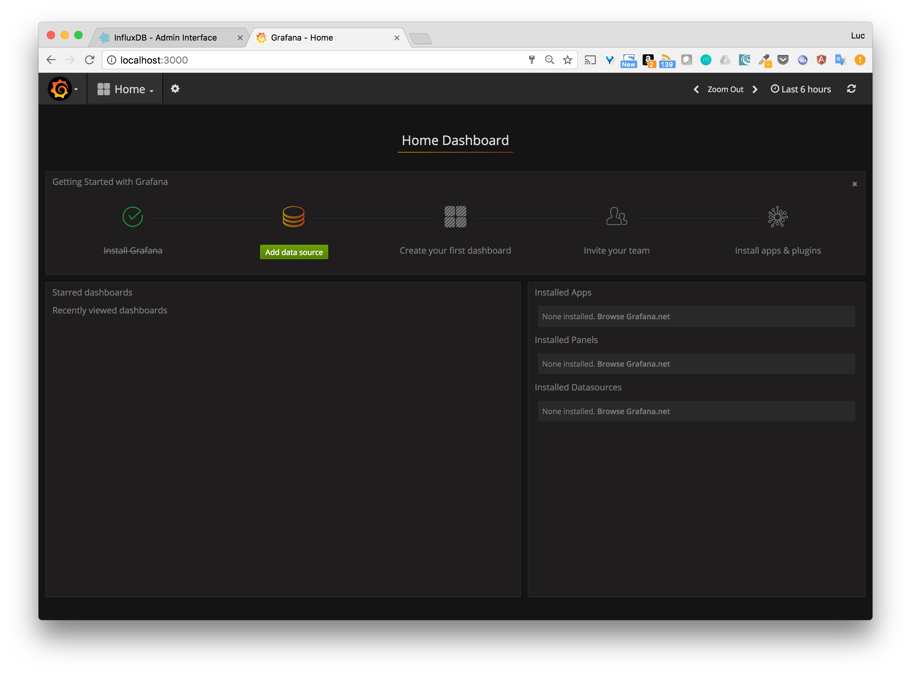
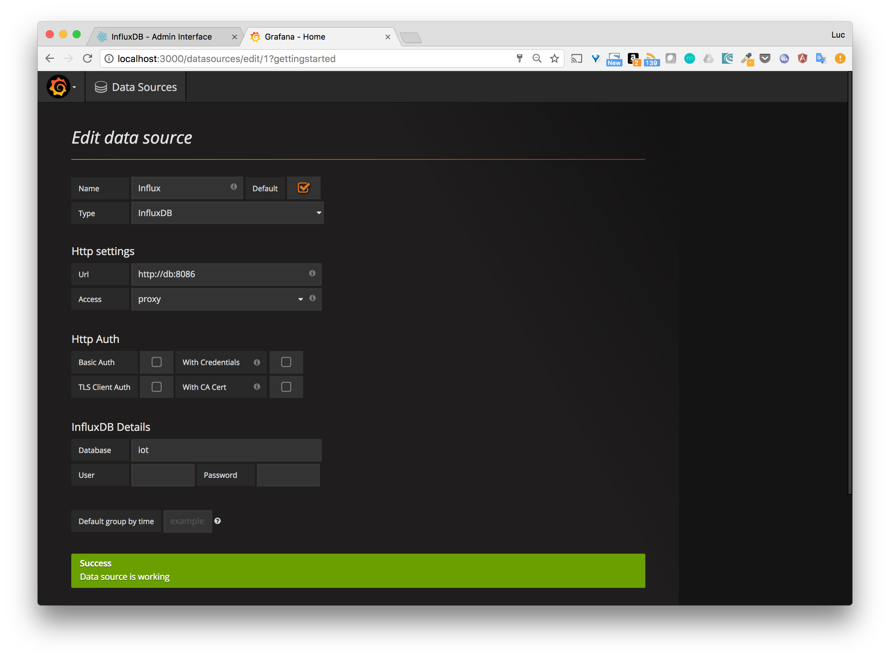

# Objectives

In this step, we will add Grafana as the visualisation service of our application.
[Grafana](http://grafana.org/) enables to create really great and neat dashboards.
We will see how easily this can be added to our Docker Compose application.

# Instructions

* Add a service, named dashboard, in the docker-compose file using grafana image
* Publish the port 3000 of the Grafana container onto the port 3000 of the host
* Run the compose application
* Run the simulator

# Details

## About Grafana

Grafana enables to create great looking dashboard, just have a look at the following one... neat isn't it ?


Checking the official Grafana image from the [Docker Hub](https://hub.docker.com/r/grafana/grafana/) we get information on how to run the application and which port needs to be exposed.
This is as easy as this:

````
docker container run -p 3000:3000 grafana/grafana
````

## Adding the dashboard service

In the docker-commose.yml file, we will add a new service, named *dashbaord*, based on the Grafana image.
The service will be simply defined as follow:

````
dashboard:
  image: grafana/grafana
  ports:
    - 3000:3000
````

## *iot* database

Let's use the InfluxDB administration interface to create our database, named *iot*.



## First step with Grafana

The Grafana interface is available on port 3000 (port exposed in the docker-compose.yml file).
The default administration credentials are *admin*/*admin*.



Once logged-in the next step is to configure the source of data we need to use to get the data.



## Configure the data source

By default, Grafana can get data from several data sources and InfluxDB is one of them. The screenshot below shows the configuration that needs to be used.
The important things to note here is the URL used to target InfluxDB's api: *http://db:8086*. This is possible because Docker Compose enables the services to communicates with each other using their names.



## Create a dashboard

The screenshot below shows how to modify the InfluxDB request to get all the data from the *data* measurement of the *iot* database.


## Run the simulator

Let's run the simulator, wait a couple of seconds and check the data appearing on the dashboard created above.

````
./simulator.sh
````


-----
[< Previous](../step6) - [Next >](../step8)
