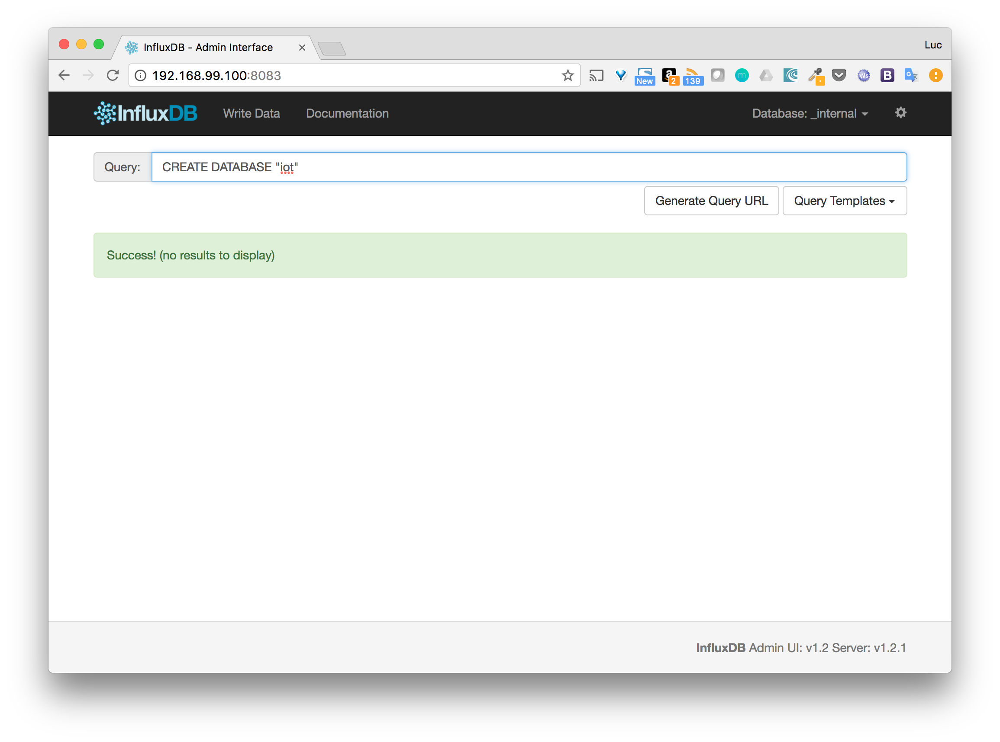

# Objectives

In this step, we will deploy the application on a remote machine.

# What we will do

* Create a Docker host using the Docker Machine tool
* Slightly modify the docker-compose.yml file to use the image from the Docker Hub
* Run the application

# Creation of a Docker Host

Let's use Docker Machine, with the driver of your choice, to create a new Docker Host

For simplicity, we use the *virtualbox* driver, but *aws*, *digitalocean*, ... can of course be used.

````
docker-machine create --driver virtualbox iot
````

Switch to the context of the newly created *iot* machine so the local client will target the daemon running on this host.

````
eval $(docker-machine env iot)
````

# Modification of the docker-compose.yml file

* db service

The usage of the local InfluxDB configuration file has been removed as relying on an external file is not portable. We will use the environment variable instead (configuration details can be found [InfluxDB Docker Hub page](https://hub.docker.com/_/influxdb/).

* api service

The *image* has been changed so it matches the name of the one that is available on the Docker Hub. Also, the *build* instruction has been removed as we will not build new image in this step but only rely on the image stored on Docker Hub.

# Run the application

The application can then be ran with the following command

````
docker-compose up
````

# Create the database

As we did before, we create the *iot* database through InfluxDB's administration interface. This one is available on port *8083* of the *iot* machine.



# Run the simulator

We have slightly modified the simulator so that *-h* and *-p* options can be specified to target a specific host:port as by default it only targets the localhost on port 1337.

To target the *iot* machine we can then run the following command

````
./simulator.sh -h $(docker-machine ip iot) -p 1337
````

Note: the IP of the machine created is retrieved from the *docker-machine ip* command.

# Visualisation with Grafana

The Grafana interface is avialable on the *MACHINE_IP:3000*. After having defined the dashboard as we did in a previous step, we can visualize the data sent by the simulator.

[Grafana data samples](./images/02-grafana-data-samples)

# Summary

We are now able to run the application on any host using the images stored on the Docker Registry.


-----
[< Previous](../step7) - [Next >](../step9)
