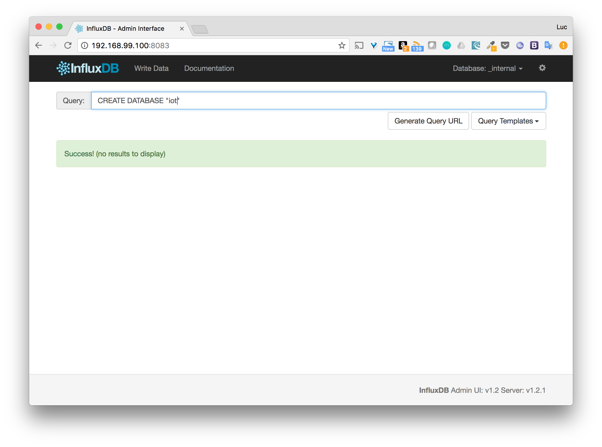
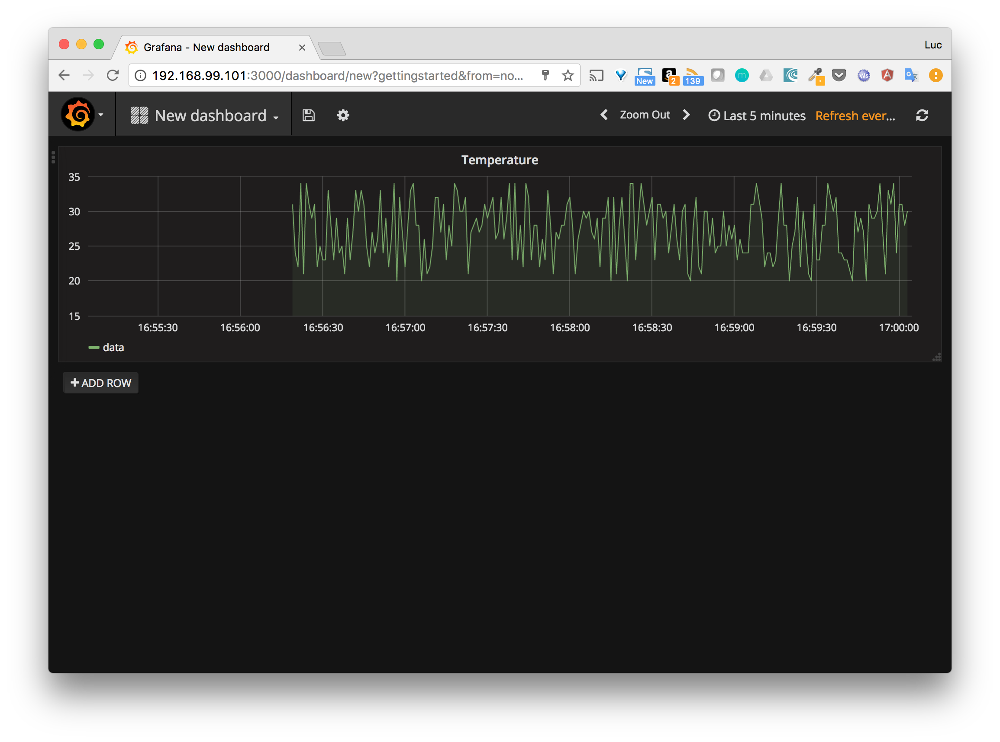

# Objectives

In this step, we will deploy the application on Docker Swarm.

# What we will do

* Create a 2 nodes Swarm
* Run the Docker Compose application as a Stack

# Creation of the Docker Swarm

We will use Docker Machine, with the *virtualbox* driver to create 2 hosts

Note: feel free to use the driver of your choice (*aws*, *digitalocean*,...).

````
docker-machine create --driver virtualbox node1
docker-machine create --driver virtualbox node2
````

Let's create the Swarm from *node1*, which make this guy the **Leader** of the future managers.

````
$ eval $(docker-machine env node1)

$ docker swarm init --advertise-addr eth1
Swarm initialized: current node (r6dr61umtoybvjtzk4etw8ffk) is now a manager.

To add a worker to this swarm, run the following command:

    docker swarm join \
    --token SWMTKN-1-6bkjrg17vocrzi767d1wd6px586dy719vutigejlnt4jqq2hvc-4slm5bpf0cydkwq4up1jggh9n \
    192.168.99.100:2377

To add a manager to this swarm, run 'docker swarm join-token manager' and follow the instructions.
````

Following the instruction provided above, we can add *node2* as a worker

````
$ eval $(docker-machine env node2)

$ docker swarm join \
     --token SWMTKN-1-6bkjrg17vocrzi767d1wd6px586dy719vutigejlnt4jqq2hvc-4slm5bpf0cydkwq4up1jggh9n \
     192.168.99.100:2377
This node joined a swarm as a worker.
````

# Run the application

From Docker version 1.13, a Docker Compose application can be ran on a Swarm using the *docker stack deploy* command and specifying the docker-compose file.
Let's deploy our application.

````
$ docker stack deploy -c docker-compose.yml iot
Creating network iot_default
Creating service iot_dashboard
Creating service iot_db
Creating service iot_api
````

The stack named *iot* has been created and contains 3 services

````
$ docker stack ls
NAME  SERVICES
iot   3
````

Let's have some additional details on the running services

````
$ docker service ls
ID            NAME           MODE        REPLICAS  IMAGE
gjrt9ox21epb  iot_db         replicated  1/1       influxdb:latest
wgyu3jvec8yc  iot_api        replicated  1/1       lucj/iot-api:v3
yyzjng3vk8d8  iot_dashboard  replicated  1/1       grafana/grafana:latest
````

The services are present, and seem to be running fine, we now check on which node each one is running.

````
$ docker service ps iot_db
ID            NAME      IMAGE            NODE   DESIRED STATE  CURRENT STATE          ERROR  PORTS
d72piw9k0fia  iot_db.1  influxdb:latest  node2  Running        Running 5 minutes ago

$ docker service ps iot_api
ID            NAME       IMAGE            NODE   DESIRED STATE  CURRENT STATE          ERROR  PORTS
ud2m9j1d3y3n  iot_api.1  lucj/iot-api:v3  node1  Running        Running 5 minutes ago

$ docker service ps iot_dashboard
ID            NAME             IMAGE                   NODE   DESIRED STATE  CURRENT STATE          ERROR  PORTS
l9j2va01ysuh  iot_dashboard.1  grafana/grafana:latest  node1  Running        Running 5 minutes ago
````

We can see from those outputs that instances (read containers) of both *dashboard* and *api* services are running on *node1*. The instance of *db* is running on node2.

# Create the database

The routing mesh feature of Docker Swarm makes each port, published by a service, available on any node.
As the InfluxDB is running on *node2*, let's access the administration interface from *node1* and create the *iot* database.



# Run the simulator

To verify once again the routing mesh feature, let's run the simulator towards *node2* (as the API is running on *node1*).

````
./simulator.sh -h $(docker-machine ip node2) -p 1337
````

# Visualize the data

As we did several times, we need to create a datasource and a dashboard form Grafana web interface.
Once this is done, we should see the data sent by the simulator.




-----
[< Previous](../step8)
